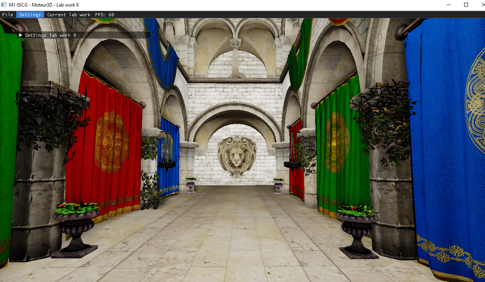

# Moteur3D
Moteur 3D en temps réel réalisé au cours de mon master ISICG à l'université de Limoges.

Au cours de cette UE nous avons pu implémenter plusieurs fonctionnalités :

- Chargement de modèle
- Eclairage avec le modèle de Phong et Blinn-Phong
- Prise en charge des textures
- Deffered Shading
- L'occlusion ambiante (SSAO)
- Tone mapping

Résultat sur sponza :

